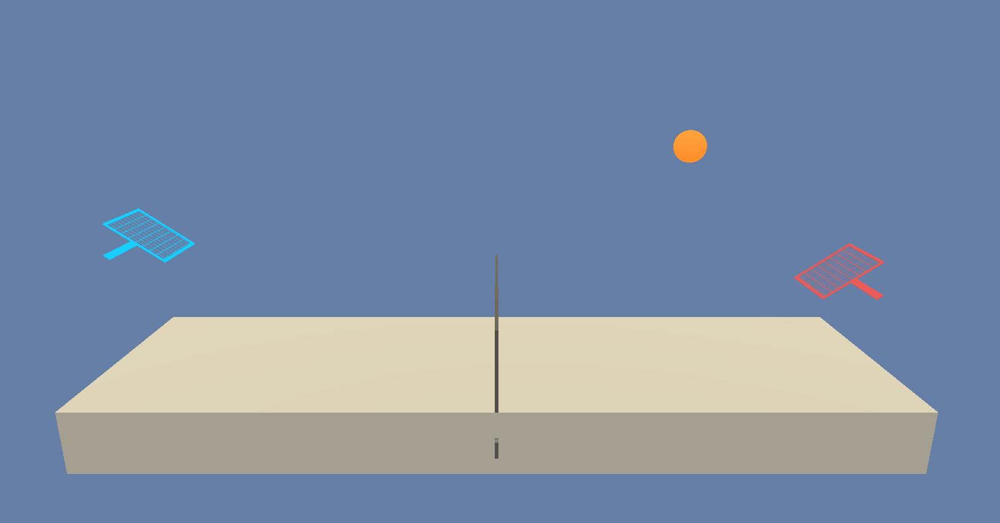

# **MAPPO Agent for Unity ML-Agents Tennis Environment**

This repository contains an implementation of a Multi-Agent Proximal Policy Optimization (MAPPO) agent designed to solve the Tennis environment from Unity ML-Agents.

## **Project Details**

### **Environment**



The Tennis environment involves two agents controlling rackets to bounce a ball over a net. If an agent hits the ball over the net, it receives a reward of +0.1. If an agent lets a ball hit the ground or hits the ball out of bounds, it receives a reward of -0.01. Thus, the goal of each agent is to keep the ball in play.

- **Number of agents:** 2
- **Action space:** Each action is a vector with 2 numbers, in the range [-1.0, +1.0], corresponding to movement toward the net or away from the net, and jumping.
- **State space:** The state space has 24 dimensions and contains the agent's position, velocity, and the position and velocity of the ball.
- **Solving the environment:** The environment is considered solved when the agents achieve an average score of +0.5 (over 100 consecutive episodes, after taking the maximum over both agents).


## **Getting Started**

### **Dependencies**

To set up your Python environment to run the code in this repository, follow the steps below:

1. **Python:** Ensure you have Python 3.6+ installed on your machine.
2. **PyTorch:** The code is based on PyTorch. You can install PyTorch by following instructions at [the official PyTorch website](https://pytorch.org/get-started/locally/).
3. **Unity ML-Agents:** The Unity environment needs to be set up as per the instructions in the [ML-Agents GitHub repository](https://github.com/Unity-Technologies/ml-agents).
4. **requirements.txt:** Use the command **pip install -r requirements.txt** for installing all the dependencies.

### **Downloading the Environment**

Download the Tennis environment from one of the links below, and place the file in the **`unity_ml_envs`** folder in the repository root:
- Linux: **[click here](https://s3-us-west-1.amazonaws.com/udacity-drlnd/P3/Tennis/Tennis_Linux.zip)**
- Mac OSX: **[click here](https://s3-us-west-1.amazonaws.com/udacity-drlnd/P3/Tennis/Tennis.app.zip)**
- Windows (32-bit): **[click here](https://s3-us-west-1.amazonaws.com/udacity-drlnd/P3/Tennis/Tennis_Windows_x86.zip)**
- Windows (64-bit): **[click here](https://s3-us-west-1.amazonaws.com/udacity-drlnd/P3/Tennis/Tennis_Windows_x86_64.zip)**

Unzip (or decompress) the file after downloading it.

## **Instructions**

Follow the steps below to train the agent:

1. **Clone the Repository:** First, clone this repository using **`git clone`**.
2. **Navigate to the Repository:** Change your current directory to the repository's root.
3. **Launch the Training Script:**
    
    To start training the agent, run the following command:
    
    ```
    cd src/
    python train.py
    
    ```
    
    This will start the training process. The training parameters can be adjusted in the **`train.py`** file.
    
4. **Monitoring the Training Process:**
    
    The script will output the average score after each episode. The environment is considered solved when the average score reaches +0.5 over 100 consecutive episodes.
    
5. **Testing the Agent:**
    
    After training, you can test the agent using the **`test_agent`** function from **`utils.py`**.